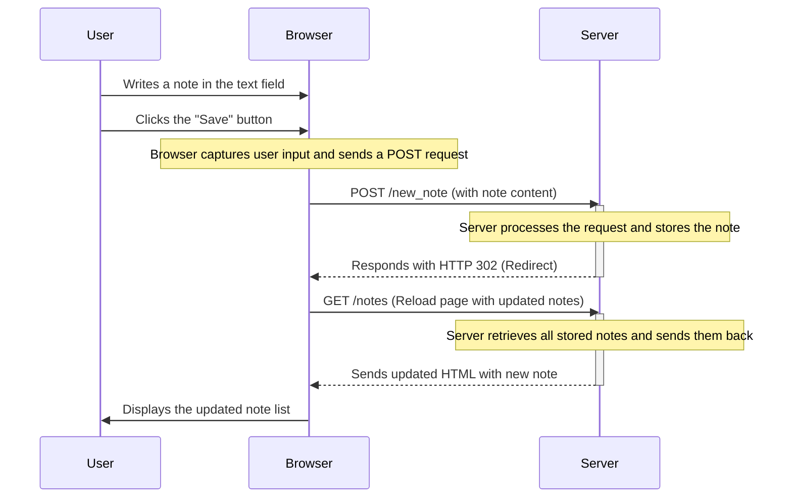

```mermaid
    sequenceDiagram
    participant User
    participant Browser
    participant Server

    User->>Browser: Writes a note in the text field
    User->>Browser: Clicks the "Save" button

    Note over Browser: Browser captures user input and sends a POST request

    
    Browser->>Server: POST /new_note (with note content)
    activate Server
    Note over Server: Server processes the request and stores the note

    Server-->>Browser: Responds with HTTP 302 (Redirect)
    deactivate Server

    Browser->>Server: GET /notes (Reload page with updated notes)
    activate Server
    Note over Server: Server retrieves all stored notes and sends them back

    Server-->>Browser: Sends updated HTML with new note
    deactivate Server
    Browser->>User: Displays the updated note list
```