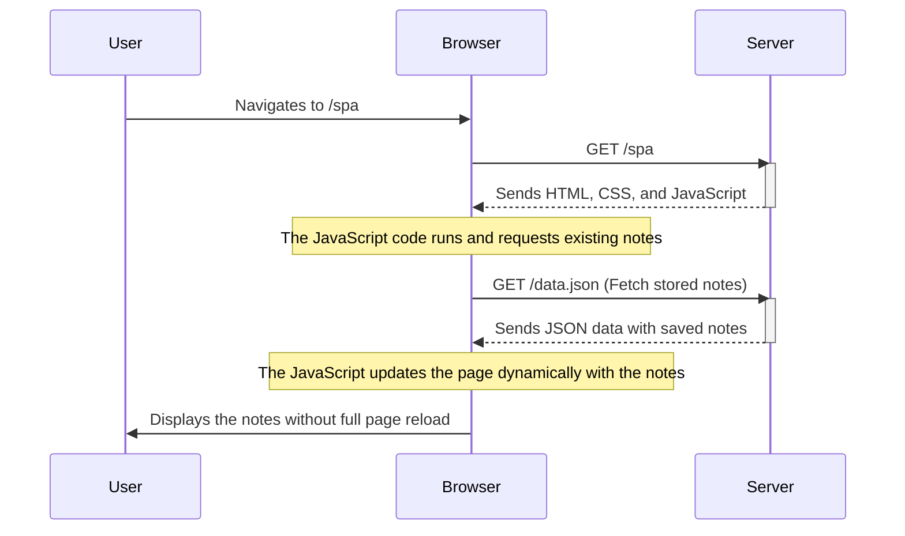

```mermaid
sequenceDiagram
    participant User
    participant Browser
    participant Server

    User->>Browser: Navigates to /spa
    Browser->>Server: GET /spa
    activate Server
    Server-->>Browser: Sends HTML, CSS, and JavaScript
    deactivate Server

    Note over Browser: The JavaScript code runs and requests existing notes

    Browser->>Server: GET /data.json (Fetch stored notes)
    activate Server
    Server-->>Browser: Sends JSON data with saved notes
    deactivate Server

    Note over Browser: The JavaScript updates the page dynamically with the notes

    Browser->>User: Displays the notes without full page reload

```