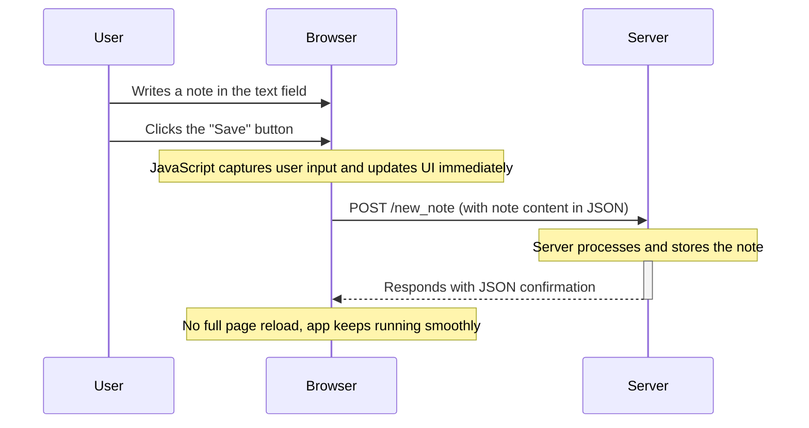

```mermaid
sequenceDiagram
    participant User
    participant Browser
    participant Server

    User->>Browser: Writes a note in the text field
    User->>Browser: Clicks the "Save" button

    Note over Browser: JavaScript captures user input and updates UI immediately

    Browser->>Server: POST /new_note (with note content in JSON)
    Note over Server: Server processes and stores the note

    activate Server
    Server-->>Browser: Responds with JSON confirmation
    deactivate Server

    Note over Browser: No full page reload, app keeps running smoothly

```